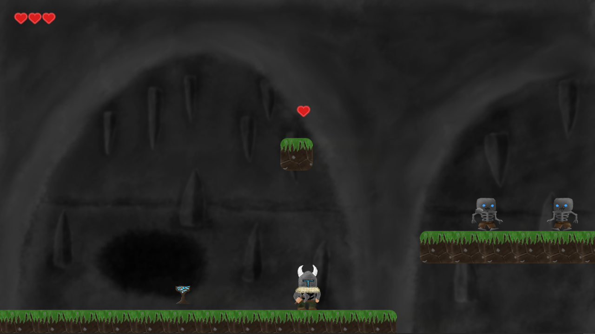
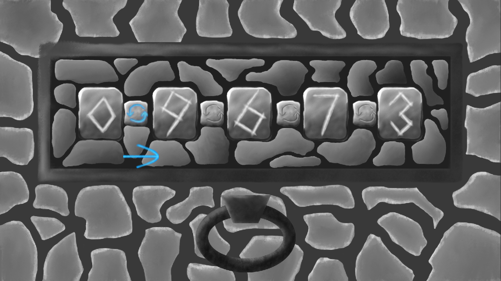
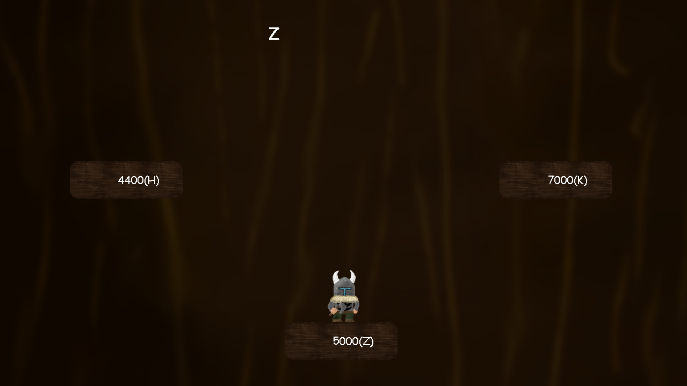

# Tree Of Life 

Kod źródłowy prostej gry platformowej napisanej w języku Python z wykorzystaniem biblioteki pygame - część praktyczna pracy inżynierskiej pt.: "Gra Platformowa z elementami algorytmiki".   
  
 * Część graficzna i fabularna projektu: [Dominik Froński (@SarisVonLupus)](https://github.com/SarisVonLupus)  
 * Część algorytmiczna i programistyczna projektu: [Mateusz Bugaj (@Paarzivall)](https://github.com/Paarzivall)
    
### Uruchomienie
1. Należy pobrać całą zawartość repozytorium komendą:
    ```
   git clone https://github.com/Paarzivall/Praca-Inzynierska.git
    ```
2. Uruchomić plik [TreeOfLife.py](TreeOfLife.py)

### Licencja
Projekt udostępniony na licencji [MIT](./LICENSE)

## Rozgrywka
### Użytkownik ma przed sobą kilka poziomów - kilka z nich jest poziomami algorytmicznymi, pozostałe są tzw. "platformówkami"

### Pierwszy Poziom


### Drugi Poziom


### Trzeci Poziom


### Czwarty Poziom


### Piąty Poziom


### Szósty Poziom

